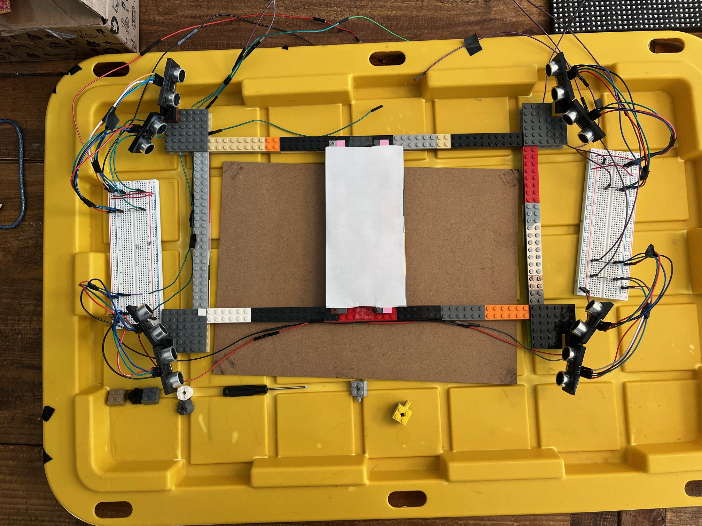

<div align="center">
    <h1>Arduino Paint</h1>
</div>

---


# Project setup

### Buy these

- [Arduino `x1`](https://store-usa.arduino.cc/products/arduino-uno-rev3?gad_source=1)
- [Proximity sensor `x8`](https://www.adafruit.com/product/4019)
- [LED screen `x1`](https://www.adafruit.com/product/2601?gad_source=1)


### Printing
- Print everything found in `models/`


### Constructing the frame
- Construct a lego frame 48x24 studs, (41.2 x 20.6 cm)

- Place a 17.8 x 8.9 cm rectangle oriented vertically in the center of the lego
  frame (see picture below if you're confused)


### Wiring up

- Place a sensor in each sensor frame.
  - Take each sensor frame and put 2 inside of each base
    (`./models/lego_base1.stl` and `./models/lego_base2.stl`)
  - Each sensor base will go on the lego frame, 4 studs diagonally backwards
    from each corner (again, refer to the picture below for details)

- You must wire the proximity sensors all together on 2 breadboards.
    - The trigger and echo pins of each sensor will be connected to the same
      rail on the breadboard
    - You can follow the diagram found in `./documentation/circuit_design.pdf`

- Connect the LED matrix to the arduino.

<details>
  <summary><b>!! Picture of setup !!</b></summary>

  
</details>


# Using and interacting the project

### Compiling & Uploading

- Plug the arduino into a computer and compile and upload the sketch by simply
  running `make`, assuming you are on mac/linux and have arduino-cli installed.

> [!WARNING] Using the arduino IDE
> If you are on windows and/or using the arduino IDE, follow these steps:
> - In the arduino IDE, copy all the `.h` files and their respective `.cpp` files into
>   the arduino library folder into a folder called `math_lib/`.
> - In `arduino-paint.ino`, change the first #include line to the following
> ```diff
> - #include "point_translation.h"
> + #include <point_translation.h>
> ```

- Once it is on, you will be able to trace on the central rectangle and see the
  same trace appear on the LED screen.

- Press the `reset` button on the arduino to clear the screen
